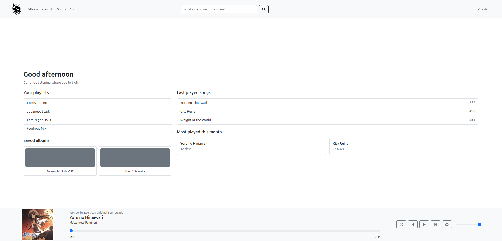

# Lynx
Lynx is a project that was originally planned to be a app made with React Native, but then I decided to make a demo on WEB, since I know much more about React than React Native. Lynx is a music library/player, where the user adds its music into the Lynx database, and he can make a library of online uploaded songs all in a single website. 

## Development
This project is still being developed, so this README and the site itself is really simple compared to the planned final version. The site will be finished before july of 2026.

## Visual
This is the home page of the project
